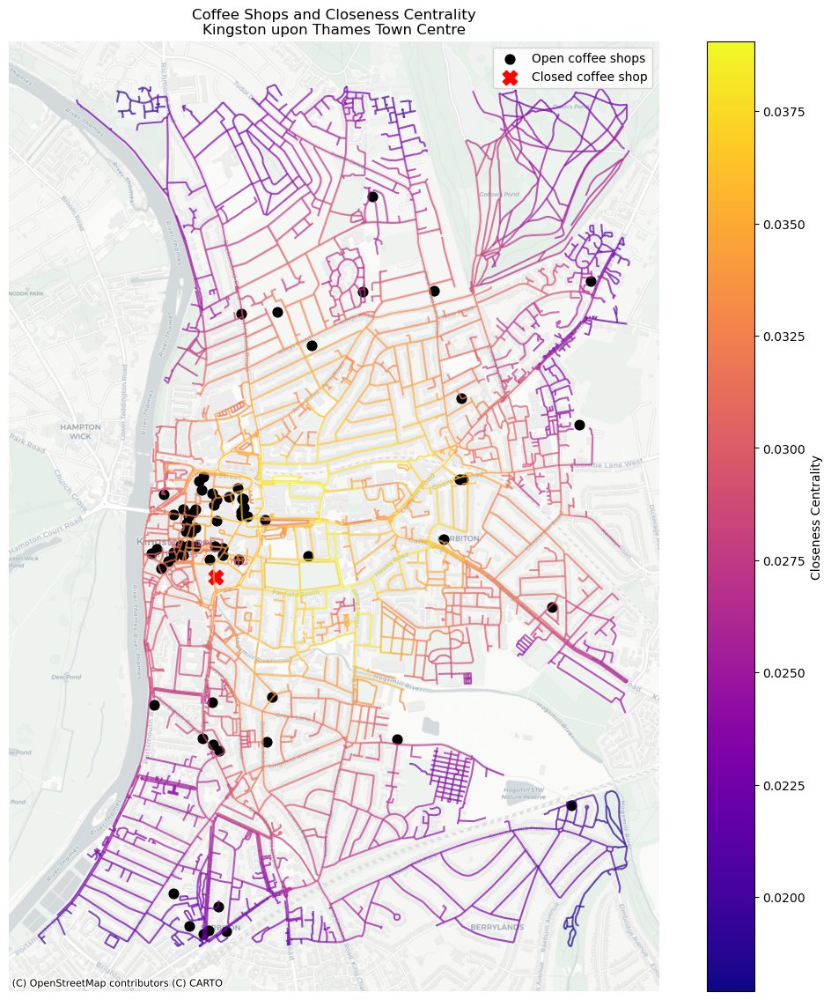
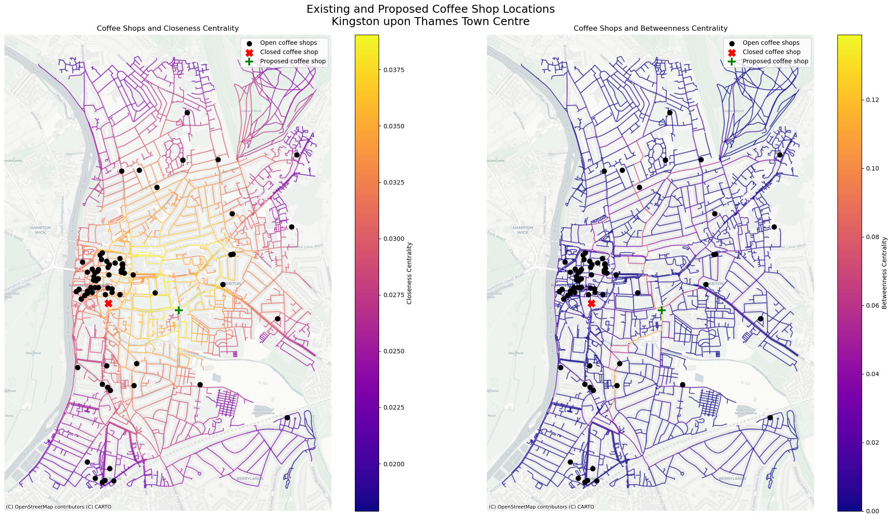

**Exploring the Relationship Between Street Network Centrality and Coffee Shop Location in Kingston upon Thames**

Kingston upon Thames town centre is a major retail and transport hub in southwest London. Kingston supports a high concentration of cafés and coffee shops catering to shoppers and commuters. However, retail and hospitality success is uneven, highlighted by the recent closure of a coffee shop in the town centre.

This study investigates whether street network centrality helps explain the spatial distribution of coffee shops in Kingston and whether low network accessibility may have contributed to the closure.


```python
# Import libraries 

import osmnx as ox
import networkx as nx
import pandas as pd
import matplotlib.pyplot as plt
import contextily as ctx
```


```python
# Download Kingston Street Network 

kingston_center = (51.410938, -0.304757)

G = ox.graph_from_point(
    kingston_center,
    dist=2000,
    network_type="walk",
    simplify=True)

print(f"Nodes: {G.number_of_nodes():,}")
print(f"Edges: {G.number_of_edges():,}")
```

    Nodes: 3,385
    Edges: 8,662
    


```python
# Load Coffee Shop File 

coffee_df = pd.read_csv("Kingston Cafe List.csv")
coffee_df.head()
```


<div>
<style scoped>
    .dataframe tbody tr th:only-of-type {
        vertical-align: middle;
    }

    .dataframe tbody tr th {
        vertical-align: top;
    }

    .dataframe thead th {
        text-align: right;
    }
</style>
<table border="1" class="dataframe">
  <thead>
    <tr style="text-align: right;">
      <th></th>
      <th>Name</th>
      <th>Latitude</th>
      <th>Longitude</th>
    </tr>
  </thead>
  <tbody>
    <tr>
      <th>0</th>
      <td>The Press Room</td>
      <td>51.39350</td>
      <td>-0.30446</td>
    </tr>
    <tr>
      <th>1</th>
      <td>Pickled Pantry</td>
      <td>51.39359</td>
      <td>-0.30292</td>
    </tr>
    <tr>
      <th>2</th>
      <td>ICON</td>
      <td>51.39365</td>
      <td>-0.30412</td>
    </tr>
    <tr>
      <th>3</th>
      <td>Café St James</td>
      <td>51.39382</td>
      <td>-0.30539</td>
    </tr>
    <tr>
      <th>4</th>
      <td>Clocktower</td>
      <td>51.39461</td>
      <td>-0.30345</td>
    </tr>
  </tbody>
</table>
</div>


```python
# Convert to GeoDataFrame

import geopandas as gpd
from shapely.geometry import Point

geometry = [Point(xy) for xy in zip(coffee_df["Longitude"], coffee_df["Latitude"])]

coffee_gdf = gpd.GeoDataFrame(
    coffee_df,
    geometry=geometry,
    crs="EPSG:4326")
```


```python
# Convert Graph for Centrality Analysis 

DG = ox.convert.to_digraph(G)
```

**Network Centrality**

In Kingston town centre, closeness centrality is highest in the core retail area, particularly around the main shopping streets and pedestrianised zones. In contrast, peripheral residential streets and areas closer to the river exhibit lower closeness values, indicating reduced overall accessibility.

High betweenness centrality is concentrated along a small number of primary corridors that connect the railway station, shopping centre, and surrounding neighbourhoods. Much of the wider network shows low betweenness, suggesting that pedestrian movement is channelled through a limited number of strategic routes rather than evenly distributed.


```python
# Convert Graph for Edge Closeness Centrality 

edge_cc = nx.closeness_centrality(nx.line_graph(DG))
nx.set_edge_attributes(DG, edge_cc, "cc")

G_cc = nx.MultiGraph(DG)
```


```python
# Edge Betweenness Centrality 

edge_bc = nx.betweenness_centrality(nx.line_graph(DG))
nx.set_edge_attributes(DG, edge_bc, "bc")

G_bc = nx.MultiGraph(DG)
```


```python
# Network Centrality Panel Map

fig, axes = plt.subplots(1, 2, figsize=(22, 12))

gdf_edges = ox.graph_to_gdfs(G_cc, nodes=False)
gdf_edges = gdf_edges.to_crs(epsg=3857)

gdf_edges_bc = ox.graph_to_gdfs(G_bc, nodes=False)
gdf_edges_bc = gdf_edges_bc.to_crs(epsg=3857)


gdf_edges.plot(
    column="cc",
    cmap="plasma",
    linewidth=1.8,
    ax=axes[0],
    legend=True,
    legend_kwds={"label": "Closeness Centrality"}
)

ctx.add_basemap(axes[0], source=ctx.providers.CartoDB.Positron)
axes[0].set_title("Closeness Centrality", fontsize=14)
axes[0].axis("off")

gdf_edges_bc.plot(
    column="bc",
    cmap="plasma",
    linewidth=1.8,
    ax=axes[1],
    legend=True,
    legend_kwds={"label": "Betweenness Centrality"})

ctx.add_basemap(axes[1], source=ctx.providers.CartoDB.Positron)
axes[1].set_title("Betweenness Centrality", fontsize=14)
axes[1].axis("off")

plt.suptitle(
    "Kingston upon Thames Town Centre – Street Network Centrality",
    fontsize=18)

plt.tight_layout()
plt.show()
```


    

    


```python
# Overlay Coffee Shops with Closeness Cnetrality

coffee_gdf = coffee_gdf.to_crs(epsg=3857)

open_shops = coffee_gdf[coffee_gdf["Name"] != "Closed"]
closed_shop = coffee_gdf[coffee_gdf["Name"] == "Closed"]

fig, ax = plt.subplots(figsize=(14, 14))

gdf_edges.plot(
    column="cc",
    cmap="plasma",
    linewidth=1.5,
    ax=ax,
    alpha=0.7,
    legend=True,
    legend_kwds={"label": "Closeness Centrality"})

open_shops.plot(
    ax=ax,
    color="black",
    markersize=60,
    label="Open coffee shops")

closed_shop.plot(
    ax=ax,
    color="red",
    markersize=140,
    marker="X",
    label="Closed coffee shop")

ctx.add_basemap(ax, source=ctx.providers.CartoDB.Positron)

plt.title("Coffee Shops and Closeness Centrality\nKingston upon Thames Town Centre")
plt.axis("off")
plt.legend()
plt.show()
```


    

    


```python
# Overlay Coffee Shop Locations with Betweenness Centrality 

fig, ax = plt.subplots(figsize=(14, 14))

gdf_edges_bc.plot(
    column="bc",
    cmap="plasma",
    linewidth=1.5,
    ax=ax,
    alpha=0.7,
    legend=True,
    legend_kwds={"label": "Betweenness Centrality"})

open_shops.plot(
    ax=ax,
    color="black",
    markersize=60,
    label="Open coffee shops")

closed_shop.plot(
    ax=ax,
    color="red",
    markersize=140,
    marker="X",
    label="Closed coffee shop")

ctx.add_basemap(ax, source=ctx.providers.CartoDB.Positron)

plt.title("Coffee Shops and Betweenness Centrality\nKingston upon Thames Town Centre")
plt.axis("off")
plt.legend()
plt.show()
```


    

    


**Coffee Shops and Network Centrality**

Coffee shops in Kingston cluster strongly within areas of high closeness centrality, reflecting a preference for highly accessible locations within the town's shopping hub. However, the closed coffee shop is also located on one of the most central streets. 

Most coffee shops, including the one that recently closed, are positioned on segments with relatively low through-movement, which reduces their exposure to passing pedestrians. This may have contributed to lower footfall and eventual closure.

I would propose, if a new coffee shop were to open, the optimal location would be positioned at the green cross on the map below, along a street with both high closeness and high betweenness centrality, maximising accessibility and pedestrian flow.


```python
# Proposed New Location 

from shapely.geometry import Point

new_shop_lat = 51.4077932
new_shop_lon = -0.2942293

new_shop_gdf = gpd.GeoDataFrame(
    {"Name": ["Proposed coffee shop"]},
    geometry=[Point(new_shop_lon, new_shop_lat)],
    crs="EPSG:4326").to_crs(epsg=3857)
```


```python
# Proposed New Location Mapped 

fig, axes = plt.subplots(1, 2, figsize=(22, 12))

gdf_edges.plot(
    column="cc",
    cmap="plasma",
    linewidth=1.5,
    ax=axes[0],
    alpha=0.7,
    legend=True,
    legend_kwds={"label": "Closeness Centrality"})

open_shops.plot(
    ax=axes[0],
    color="black",
    markersize=60,
    label="Open coffee shops",
    zorder=3)

closed_shop.plot(
    ax=axes[0],
    color="red",
    markersize=140,
    marker="X",
    label="Closed coffee shop",
    zorder=4)

new_shop_gdf.plot(
    ax=axes[0],
    color="green",
    markersize=180,
    marker="+",
    linewidth=3,
    label="Proposed coffee shop",
    zorder=5)

ctx.add_basemap(axes[0], source=ctx.providers.CartoDB.Positron)
axes[0].set_title("Coffee Shops and Closeness Centrality")
axes[0].axis("off")
axes[0].legend(loc="upper right")

gdf_edges_bc.plot(
    column="bc",
    cmap="plasma",
    linewidth=1.5,
    ax=axes[1],
    alpha=0.7,
    legend=True,
    legend_kwds={"label": "Betweenness Centrality"})

open_shops.plot(
    ax=axes[1],
    color="black",
    markersize=60,
    label="Open coffee shops",
    zorder=3)

closed_shop.plot(
    ax=axes[1],
    color="red",
    markersize=140,
    marker="X",
    label="Closed coffee shop",
    zorder=4)

new_shop_gdf.plot(
    ax=axes[1],
    color="green",
    markersize=180,
    marker="+",
    linewidth=3,
    label="Proposed coffee shop",
    zorder=5)

ctx.add_basemap(axes[1], source=ctx.providers.CartoDB.Positron)
axes[1].set_title("Coffee Shops and Betweenness Centrality")
axes[1].axis("off")
axes[1].legend(loc="upper right")

plt.suptitle(
    "Existing and Proposed Coffee Shop Locations\nKingston upon Thames Town Centre",
    fontsize=18)

plt.tight_layout()
plt.show()
```


    

    

